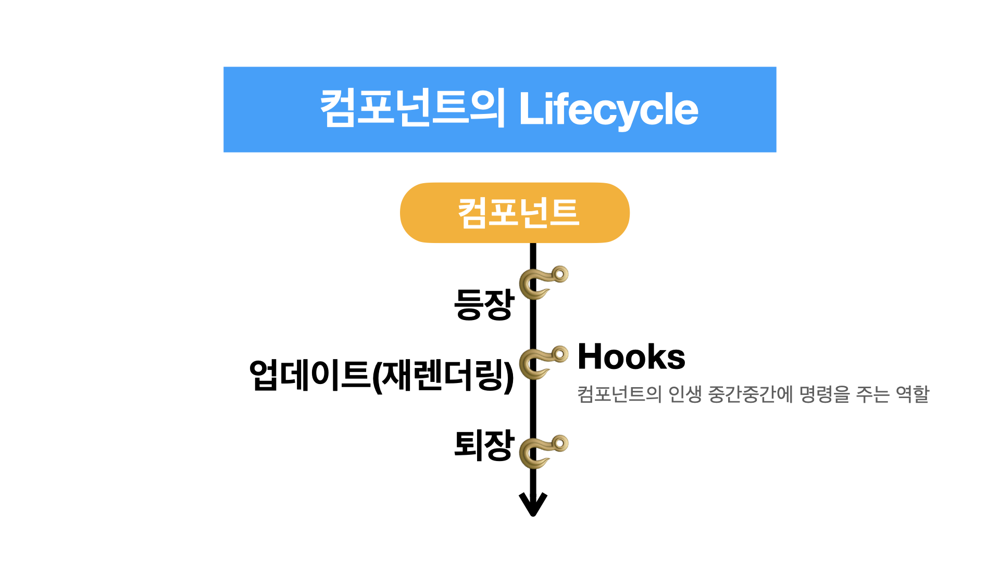

---
emoji:
title: Life Cycle
date: '2022-01-11 00:04:18'
author: Rachel
tags: Front Study React
categories: React
---



## <p style="font-weight: 900; background-color: #f7f3f8; color: #9065af;">class형 컴포넌트에서의 lifecycle</p>

```jsx
class Detail2 extends React.Component {
  componentDidMount() {
    //Detail2 컴포넌트가 Mount 되었을 때 실행할 코드 (등장)
    //ex. Ajax 요청, 페이지 렌더링 되자마자 데이터 불러와줘~
  }
  componentWillUnmount() {
    //Detail2컴포넌트가 Unmount되기 직전에 실행할 코드 (퇴장)
  }
}
```

### <span style="font-weight: 700;">Life Cycle method</span>

- 각각의 컴포넌트들은 각자의 라이프 사이클을 가지며, 총 3가지 단계로 나뉜다.
  Mounting(생성or마운트), Updating(업데이트), and Unmounting(제거or언마운트)
  

#### 1. Mounting(마운트)

DOM이 생성되고 나서 웹 브라우저 상에 요소들을 나열하는 과정
컴포넌트를 생성하기 위해 호출되는 4가지의 리액트 내장 메서드

- `constructor` : **컴포넌트를 새로 만들 때마다 호출되는 클래스 생성자 메서드**,
  props와 함께 파라미터로 호출됨. super(props)를 반드시 호출함으로써, 컴포넌트가 부모로부터 메서드를 상속받을 수 있는 상태가 된다.
- `getDerivedStateFromProps` : **props에 있는 값을 state에 넣을 때 사용하는 메서드**
  state를 파라미터로 받는다. DOM이 렌더링 하기 직전에 호출되는 메서드이다.
- `render` : **UI를 렌더링**
- `componentDidMount` : **컴포넌트가 웹 브라우저상에 나타난 후에 호출하는 메서드**
  이미 DOM 상에 있는 컴포넌트들을 다룰 때 사용한다.

#### 2. Updating(업데이트)

컴포넌트가 업데이트 될 때 실행되는 메서드들
업데이트 되는 경우 : props가 바뀔때, state가 바뀔때, 부모 컴포넌트가 리렌더링 될 때, this.forceUpdate로 강제로 렌더링을 트리거할 때

- `getDerivedStateFromProps` : 마운트 과정에서도 호출. 업데이트가 시작하기 전에도 호출. **props의 변화에 따라 state값에 변화를 주고 싶을 때 사용** -`shouldComponentUpdate` : 컴포넌트가 **렌더링을 할 것인지 결정하는 메서드(Boolean 값 반환)**
  true : 다음 라이프사이클 메서드를 실행
  false: 작업 중지
  ✔ 특정함수에서 this.forceUpdate()사용시 이 과정 생략, render()함수 즉시 호출
- `render`: 컴포넌트를 리렌더링
- `getSanpshotBeforeUpdate` : 컴포넌트 **변화를 DOM에 반영하기 직전에 호출**하는 메서드
  업데이트 전/후의 state, props에 접근이 가능해서 비교해 볼 수 있다.
  이 메서드가 있으면 `componentDidUpdate()`와 반드시 함께 사용해야 한다.
- `componentDidUpdate` : **컴포넌트의 업데이트 작업이 끝난 후 호출하는 메서드**

#### 3. Unmounting(언마운트)

컴포넌트를 DOM에서 제거하는 과정

- `componentWillUnmount` : **컴포넌트가 웹 브라우저 상에서 사라지기 전에 호출하는 메서드**

---

### 📌 각 메서드들 자세히 살펴보기


> #### render( )
>
> 필수 메서드로 컴포넌트의 생김새를 결정하는 함수이다.
> this.props와 this.state안에 접근할 수 있고, 리액트 요소를 반환한다.
> ✔ 이벤트 설정이 아닌 곳에서 setState를 사용하면 안됨
> ✔ 브라우저의 DOM에 접근해서도 안됨
> ➡ DOM의 정보를 가져오거나 state에 변화를 줄 때 : componentDidMount 처리

> #### constructor ( )
>
> 컴포넌트 생성자 메서드
> 초기 state 설정

> #### getDerivedStateFromProps( )
>
> props로 받아온 값을 state로 업데이트 시키는 용도 (ver.16.3 이상 적용)
> 컴포넌트가 마운트 될 때, 업데이트 될 때 호출

> #### componentDidMount( )
>
> 첫 렌더링을 마친 후 실행
> 비동기 작업을 처리할 때 사용

> #### shouldComponentUpdate ( )
>
> props or state 변경 시 재렌더링 여부를 묻는 메서드
> default값은 true이며, false값을 반환할 경우 업데이트 중지

- 현재 props, state : `this.props`, `this.state`
- 새로 설정될 props, state: `nextProps`, `nextState`

> #### getSnapshotBeforeUpdate ( )
>
> render에서 반영된 결과물이 브라우저에 실제로 반영되기 직전 호출
> ex. 업데이트 하기 전의 현재 스크롤바의 위치 유지

```js
getSnapshotBeforeUpdate(prevProps, prevState) {
  if(prevState.array ! == this.state.array){
  const { scrollTop, scrollHeight } = this.lis
  return { scrollTop, scrollHeight };
  }
}
```

> #### componentDidUpdate ( prevProps, prevState, snapshot) { ... }
>
> 업데이트가 끝난 직후 실행
> 이전에 가졌던 데이터에 접근 가능(prevProps, prevState 이용)

> #### componentDidCatch ( error, info) { .. }
>
> 렌더링 도중 에러가 발생했을 때, 오류 UI를 보여주는 메서드

- error: 어떤 에러가 발생했는지 알려준다. (단, this.props.children으로 전달되는 컴포넌트에서 발생하는 에러만 잡아준다.)
- info : 어디에 있는 코드에서 오류가 발생했는지 알려준다.
  <br/>
  <br/>
  <br/>

## <p style="font-weight: 900; background-color: #f7f3f8; color: #9065af;">function형 컴포넌트에서의 lifecycle : **useEffect()사용**</p>

🍇 컴포넌트가 **생성, 업데이트 될 때** 특정 코드를 실행할 수 있다.

```jsx
import { useEffect } from 'react';

function App() {
  useEffect(() => {
    {
      /*rendering이 될 때 마다 실행되는 부분*/
    }
  });
  return <div></div>;
}
```

<br/>

🍇 컴포넌트가 **사라질 때**(unmount 될 때) → `return` 문으로 반환해준다

```jsx
import { useEffect } from 'react';

function App() {
  useEffect(() => {
    return function 이름() {
      실행코드;
    };
    or;
    return () => {
      실행코드;
    };
  });
  return <div></div>;
}
```

<br/>

🍇 useEffect **여러번** 사용할 때

```jsx
import React, { useState, useEffect } from 'react';

function App() {
  useEffect(() => {
    //첫 번째 실행되는 코드
  });
  useEffect(() => {
    //두 번째로 실행되는 코드
  });

  return <div></div>;
}
```

<br/>
🍇 최초1회만 실행하고, 업데이트때는 실행하지 않음

```jsx
useEffect(() => {
  실행코드;
}, []);
```

<br/>
🍇 특정state값이 변경될때만 실행됨

```jsx
useEffect(() => {
  let 타이머 = setTimeout(() => {
    alert변경(false);
  }, 2000);
}, [alert]);
```

<br/>

💡 **state값에 따라서 UI가 보여지고/ 안보여지게 만들었는데 항상 이렇게 만듭니까?**
<br/>→ **YES**, 항상 보이는 UI가 아니라면 이렇게 만든다.

<br/>

```jsx
const [hideAlarm, setHideAlarm] = useState(false);
...
useEffect(() => {
    let handleAlarm = setTimeout(() => {
      setHideAlarm(true);
    }, 2000);
  }, []);
....
{!hideAlarm ? (
        <div className="my-alert">
          <p>* 재고가 얼마 남지 않았습니다</p>
        </div>
      )
 : null
}
```
